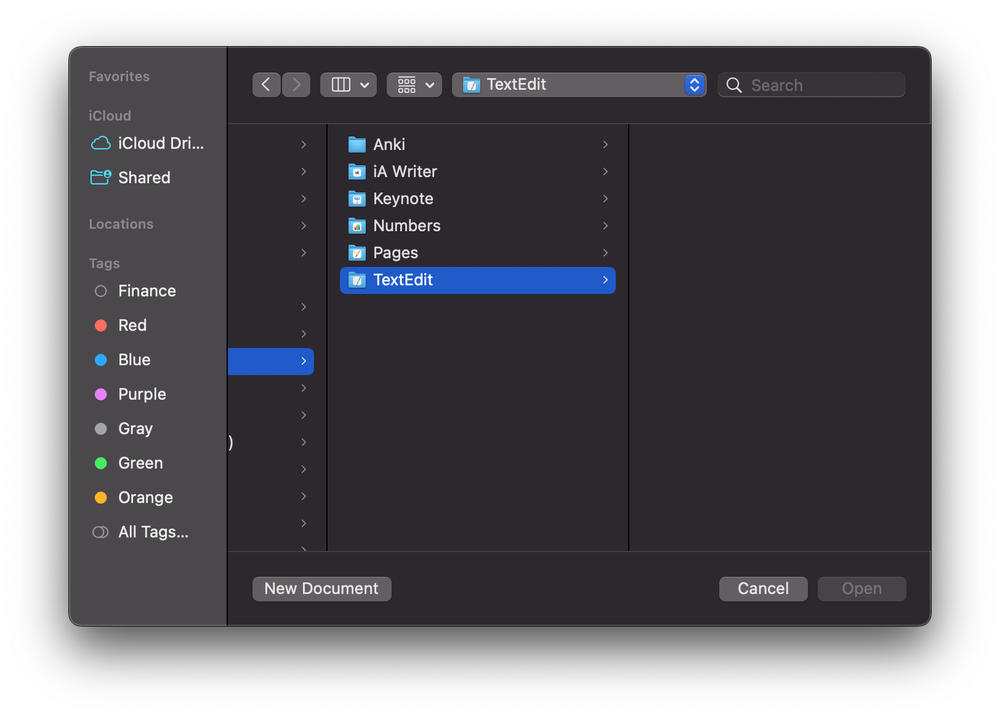

# Background

This is an example app that tries to achieve a window/scene setup similar to Xcode:

* A single Welcome window appears first (e.g. to offer options like creating
  a new document, opening a test document or show a list of recent documents).
* Other than that, the application is a document based app that can be used to
  edit documents (simple text documents in this example app).

The goal is to use SwiftUI as much as possible.

# Challenges

1. Offering the ability to open auxiliary files (i.e. files that are _not_ the
   actual document files but files the application understands and might add to
   its document view) does not seem to work seamless when relying on
   [`onOpenUrl`](https://developer.apple.com/documentation/swiftui/view/onopenurl(perform:)).
2. On initial launch, the application opens the file panel (offering options to
   create a new document or select an existing one). There does not seem to be
   away to prevent this from happening. Neither
   `NSApplicationDelegate#applicationShouldOpenUntitledFile(_:)` nor
   `NSApplicationDelegate#applicationOpenUntitledFile(_:)` in the registered
   delegate.

## Problem 1

The example app has an additional document type configured (SQLite database
files) it should be able to handle in addition to its main document files.

Example scenario: The user drags an SQLite file `test.db` to the Dock icon or
chooses the "Open With" option in the file context menu.  In response, the
application opens a new document and adds some SQLite specific content to the
document (in this example, simply the name of the file).  E.g. similar to Xcode
being able to open Markdown (`.md`) in addition to Xcode projects.

[`onOpenUrl`](https://developer.apple.com/documentation/swiftui/view/onopenurl(perform:))
seems like an option but does not seem to work when used within
a `DocumentGroup` scene. I.e. `onOpenUrl` never gets called in when added
there.

The documentation for `onOpenUrl` states: 

> Registers a handler to invoke when the view receives a url for the scene or window the view is in.

It does work in the example app when added to the welcome window scene (as
configured in the example).

Unfortunately that has the side effect of opening the welcome window (which at
this point is likely not visible or is at least unrelated to the desired user
action of opening an auxiliary file).  The example app tries to hide that by
closing the window after opening the auxiliary file but the welcome window is
still briefly visible (which is undesirable).

Question:

* Is using
  [`onOpenUrl`](https://developer.apple.com/documentation/swiftui/view/onopenurl(perform:))
  on a `DocumentGroup` scene not supported?
* Is there a better way of setting this up without moving to managing the
  welcome window with AppKit?

## Problem 2

The welcome window is the expected way for the user to interact with the
application when the application starts and there are no document windows to
restore.  Showing the initial file selection panel is therefore undesirable.

When the application is launched for the first time:

Question: 

* Is there a way to suppress this behaviour?
* Is it expected that the
  `NSApplicationDelegate#applicationShouldOpenUntitledFile(_:)` and
  `NSApplicationDelegate#applicationOpenUntitledFile(_:)` never get called?

